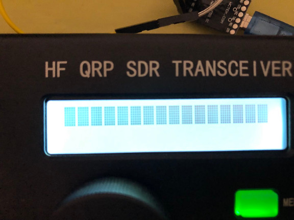
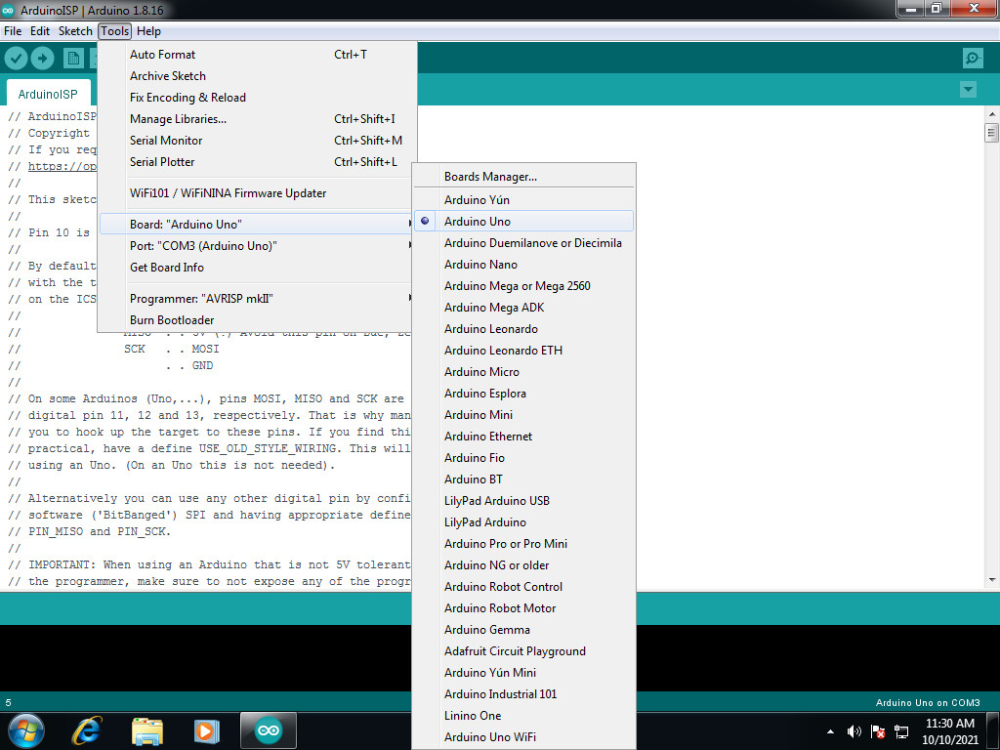
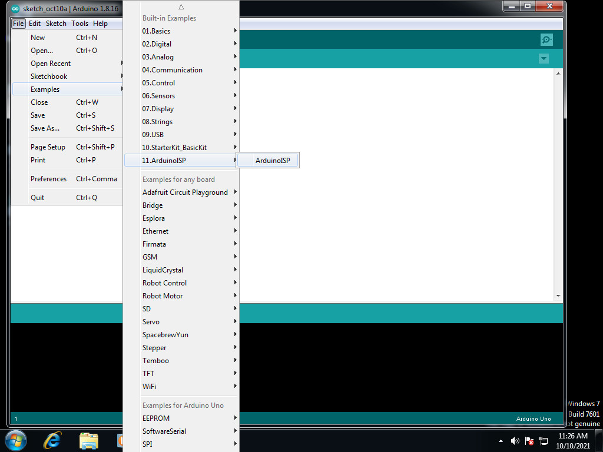
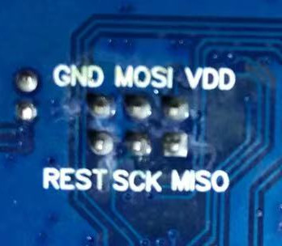
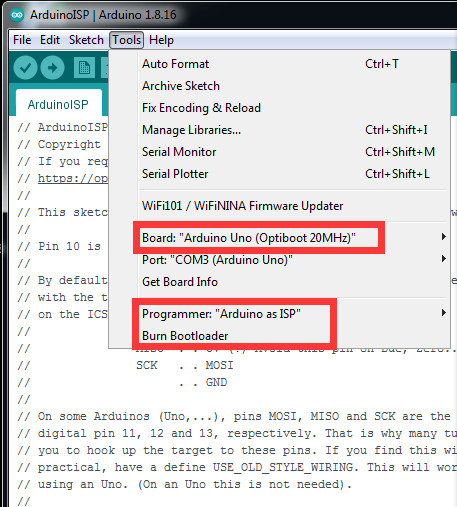
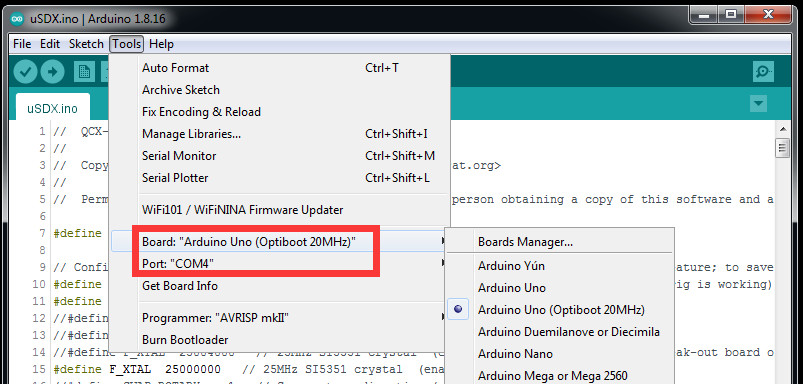

# 声明: 本人与uSDX/uSDR项目或产品或人物没有任何利益关系，玩uSDX本着开源精神积极奉献的心态。

## 前言
首先要非常感谢Guido pe1nnz@amsat.org 和 Manuel DL2MAN创造并开源了uSDX，感谢所有代码贡献者的付出和努力，让uSDX成为了一台简洁高效的QRP电台。
其次请允许我在此表达对BA7LJL的由衷感谢，没有他的帮助就不可能有这篇手记，我也不可能这么快就能体验到参与修改uSDX固件的乐趣。再要感谢中国的爱好者们
设计了精美结实的外壳并集成了巨大容量的锂离子充电电池，让uSDX成为一台便捷的掌上QRP短波电台。
我很幸运有机会参与了该产品外形设计的讨论过程，很高兴还帮助发现了一点小小的瑕疵。
我有幸成为首批用户之一，第一时间测试一台新设备是一件非常令人激动的事情，但同时也会面临一些挑战。今天我们就来探讨第一个大家需要面对的挑战如何刷固件。

## 准备工作
### 需要硬件
1. 当然你需要一个USB到TTL的转换器，这个转换器最好是已经带有DTR端口，如果找不到至少需要一个有5V端口的USB-TTL转换器
2. 按照您的uSDX引出接脚的定义和接口方式，您会需要用到相应的接口。我的uSDX是通过一个4环的(3+1)3.5mm音频插座提供TTL端口。那您会需要用到一个相应的插头，免焊插头是一个方便的选择
3. USB-TTL转换器通常是板上提供了一些I/O针，那就需要用一些杜邦线。针-座和针-针的杜邦线都可能会用到几根
4. 如果您的机器是没有刷引导程序的（见下文的看看是否中奖），或是主频不对的引导程序，您会需要附加的2件器材。一个ISP接口，我推荐大家用Arduino Uno或Arduino Nano。因为它不单单可以刷uSDX，还可以带给您很多其它乐趣。实在不喜欢Arduino Uno/Nano 那就调一款自己喜欢的USB-ISP的转换器吧
5. 如果您不想把您的uSDX像我那样拆的七零八落，那就需要小小的破费一点，买一套2.54mm 3x2（共6针2排）的烧录探针，或像笔者一样用两块PCB版自制了一套探针。
### 需要的软件
1. 安装Arduino IDE。您应该已经了解，uSDX的软件是采用Arduino开发的，使用Arduino IDE不但可以用来升级uSDX的固件，还可以直接修改uSDX源代码，创造一台个性的uSDX。下载地址: https://www.arduino.cc/en/software

## 看看是否中奖了
也许幸运的你直接抽中了乐透呢，来看看是否中奖了吧。首先确保您的uSDX内置电池有足够的电力或已经有合适的外置电源，先将电源开关拨到中档关闭uSDX，然后盯着屏幕开机。如果上电的瞬间LCD屏幕第一行黑块（见图1），那恭喜您！您的uSDX已经安装了引导，可以直接通过TTL升级固件了。如果开机时uSDX毫不犹豫地显示版本号进入主界面了，同样恭喜您！获得刷Arduino引导程序的乐趣。
| 图1 |
| --- |
|  |
## 为uSDX烧入引导
### 添加20MHz的ATMega328P板
为了提高ATMega328P的处理能力，uSDX采用的是20MHz的主频时钟，但是默认的Arduino Nano或Uno都是采用16MHz的时钟频率。为了能让uSDX正常工作，就需要20MHz主频的板信息。有以下3种方式: 
   1. 找到Arduino IDE自带的那个AVR板文件，先备份再用下载的这个的 [boards.txt](boards.txt) 文件覆盖，重启动Arduino IDE就会发现出现了20MHz的Nano板了
   2. 动手自己修改一个20MHz的板信息：
      1. 将当前目录换到：`c:\Program Files (x86)\Arduino\hardware\arduino\avr`
      2. 备份当前的板信息：`copy boards.txt boards-orig.txt`
      3. 用能支持Unix模式文本格式编辑器打开板文件：`boards.txt`
      4. 添加下面的信息到 `Arduino Nano w/ ATmega328P (old bootloader)` 快的下方：
        ```
        ## Arduino Nano w/ ATmega328P (old bootloader)
        ## --------------------------
        nano.menu.cpu.atmega328old20Mhz=ATmega328P (Old Bootloader-20Mhz)

        nano.menu.cpu.atmega328old20Mhz.upload.maximum_size=30720
        nano.menu.cpu.atmega328old20Mhz.upload.maximum_data_size=2048
        nano.menu.cpu.atmega328old20Mhz.upload.speed=72000

        nano.menu.cpu.atmega328old20Mhz.bootloader.low_fuses=0xFF
        nano.menu.cpu.atmega328old20Mhz.bootloader.high_fuses=0xDA
        nano.menu.cpu.atmega328old20Mhz.bootloader.extended_fuses=0xFD
        nano.menu.cpu.atmega328old20Mhz.bootloader.file=atmega/ATmegaBOOT_168_atmega328.hex

        nano.menu.cpu.atmega328old20Mhz.build.mcu=atmega328p        
        ```
      5. 保存 `boards.txt` 后重新打开 Arduino IDE，就可以看见 `Old Bootloader-20MHz`

   3. 重新编译生成20MHz的板信息和引导程序，没时间？没兴趣，没事，别人已经帮我们做好了，[这里下载](https://www.macetech.com/Arduino_20MHz.zip)，同样的用其中的boards.txt文件替代Arduino IDE自带的相应文件，并将其中的.HEX引导文件放在相应的bootloader目录。
   4. 挑战一下自己？，给uSDX刷一个只有0.5KB的引导程序，省出1.5KB给主程序用，并且让USB-TTL不再使用非标准的72000波特率？那就让我们开始吧 (也可以参考: https://tttapa.github.io/Pages/Arduino/Bootloaders/ATmega328P-custom-frequency.html)
      1. [下载并安装MinGW](https://osdn.net/projects/mingw/downloads/68260/mingw-get-setup.exe/)
      2. 安装下面的这些软件包:
         - mingw-developer-toolkit
         - mingw32-base
         - mingw32-gcc-g++
         - msys-base
      3. 执行下面的命令添加到系统PATH环境变量
          ```
          set AVR_DIR=C:\Program Files (x86)\Arduino\hardware\tools\avr
          set PATH=%AVR_DIR%\bin;%AVR_DIR%\etc;C:\MinGW\bin;%PATH%
          ```
      4. 以 Administrator 方式打开一个命令行提示符，并执行下面的命令把当前的 optiboot 做个目录备份：
          ```
          cd "c:\Program Files (x86)\Arduino\hardware\arduino\avr\bootloaders"
          move optiboot optiboot-orig
          ```
      5. 下载最近的 
      6. 解压后，把其中的 optiboot 目录复制到 `c:\Program Files (x86)\Arduino\hardware\arduino\avr\bootloaders\` 目录下
      7. 运行 `c:\MinGW\msys\1.0\msys.bat` 进入MinGW的Bash Shell
      8. 将当前目录换到`optiboot`源代码目录下: `cd /c/Program Files (x86)/Arduino/hardware/arduino/avr/bootloaders/optiboot`
      9. 用您熟悉的编辑软件打开`Makefile`， 并添加下面的内容到`atmega328_pro8_isp: isp` 后面:
          ```
          # atmega328_pro_20MHz
          atmega328_pro20: TARGET = atmega328_pro_20MHz
          atmega328_pro20: CHIP = atmega328
          atmega328_pro20:
                  "$(MAKE)" $(CHIP) AVR_FREQ=20000000L LED_START_FLASHES=3
                  mv $(PROGRAM)_$(CHIP).hex $(PROGRAM)_$(TARGET).hex
          ifndef PRODUCTION
                  mv $(PROGRAM)_$(CHIP).lst $(PROGRAM)_$(TARGET).lst
          endif

          atmega328_pro20_isp: atmega328_pro20
          atmega328_pro20_isp: TARGET = atmega328_pro_20MHz
          atmega328_pro20_isp: MCU_TARGET = atmega328p
          # 512 byte boot, SPIEN
          atmega328_pro20_isp: HFUSE ?= DE
          # Low power xtal (20MHz) 16KCK/14CK+65ms
          atmega328_pro20_isp: LFUSE ?= FF
          # 2.7V brownout
          atmega328_pro20_isp: EFUSE ?= FD
          atmega328_pro20_isp: isp
          ```

          ```
          # 20MHz atmega328p
          atmega328_pro20: TARGET = atmega328_pro_20MHz
          atmega328_pro20: MCU_TARGET = atmega328p
          atmega328_pro20: CFLAGS += '-DLED_START_FLASHES=3' '-DBAUD_RATE=115200'
          atmega328_pro20: AVR_FREQ = 20000000L
          atmega328_pro20: LDSECTIONS = -Wl,--section-start=.text=0x7e00 -Wl,--section-start=.version=0x7ffe
          atmega328_pro20: $(PROGRAM)_atmega328_pro_20MHz.hex
          atmega328_pro20: $(PROGRAM)_atmega328_pro_20MHz.lst

          atmega328_pro20_isp: atmega328_pro20
          atmega328_pro20_isp: TARGET = atmega328_pro_20MHz
          atmega328_pro20_isp: MCU_TARGET = atmega328p
          # 512 byte boot, SPIEN
          atmega328_pro20_isp: HFUSE = DE
          # Low power xtal (20MHz) 16KCK/14CK+65ms
          atmega328_pro20_isp: LFUSE = FF
          # 2.7V brownout
          atmega328_pro20_isp: EFUSE = 05
          atmega328_pro20_isp: isp
          ```
      10. 运行 `make atmega328_pro20`, 就生成的 optiboot_atmega328_pro_20MHz.hex 和 optiboot_atmega328_pro_20MHz.lst 文件复制 `C:\Users\john\AppData\Local\VirtualStore\Program Files (x86)\Arduino\hardware\arduino\avr\bootloaders\optiboot\` 目录下
      11. 将当前目录切换到: `c:\Program Files (x86)\Arduino\hardware\arduino\avr`
      12. 用编辑器打开扳信息文件，找到`uno.build.variant=standard` 添加下面内容到它后面:
        ```
        ##############################################################
        uno20.name=Arduino Uno (Optiboot 20MHz)

        uno20.vid.0=0x2341
        uno20.pid.0=0x0043
        uno20.vid.1=0x2341
        uno20.pid.1=0x0001
        uno20.vid.2=0x2A03
        uno20.pid.2=0x0043
        uno20.vid.3=0x2341
        uno20.pid.3=0x0243

        uno20.upload.tool=avrdude
        uno20.upload.protocol=arduino
        uno20.upload.maximum_size=32256
        uno20.upload.maximum_data_size=2048
        uno20.upload.speed=115200

        uno20.bootloader.tool=avrdude
        uno20.bootloader.low_fuses=0xFF
        uno20.bootloader.high_fuses=0xDE
        uno20.bootloader.extended_fuses=0xFD
        uno20.bootloader.unlock_bits=0x3F
        uno20.bootloader.lock_bits=0x0F
        uno20.bootloader.file=optiboot/optiboot_atmega328_pro_20MHz.hex

        uno20.build.mcu=atmega328p
        uno20.build.f_cpu=20000000L
        uno20.build.board=AVR_UNO
        uno20.build.core=arduino
        uno20.build.variant=standard
        ```

### 将Arduino Uno 转换为ISP编程器
为了实现更方便的USB-TTL连接uSDX的UART端馈实现固件更新，需要首先为uSDX中的ATMeage328P烧入引导程序。引导程序烧入需要用到 ISP接口，我推荐Arduino Uno。那第一步就是要让Arduino Uno成为ISP编程器:
  1. 将您的Arduino Uno通过USB连接到电脑，等待Windows发现Arduino Uno和COM设备，并安装相应驱动程序
  2. 运行Arduino IDE，点菜单Tools > Board 选取Arduino Uno 
  3. 点File > Examples > ArduinoISP > ArduinoISP 
  4. 然后点击 Upload， 片刻完成后你的Arduino Uno就可以作为 ISP 编程器为uSDX灌入引导程序服务了

### 连接探针和 Arduino Uno
接下来就需要将探针连接到 `Arduino Uno` 上：
   1. 取下uSDX两侧的各4颗螺丝，并取下侧板和后盖
   2. 可以看到下面的 
   3. 根据下面的表连接相应探针到 `Arduino Uno` 相应的脚：
      |uSDX/QCX|Arduino Uno|
      |-|-|
      |GND|GND|
      |MOSI|11|
      |VDD|5V|
      |RESET|10|
      |SCK|13|
      |MISO|12|

### 开始为uSDX烧入引导
当主频为20MHz的板信息和引导都已经准备好了，您也为 `Arduino Uno` 装载成功了 `ArduinoISP` ，探针也已经与 `Arduino Uno`正确连接好了，接下来就是正式的烧入引导程序了
  1. 打开 `Arduino IDE`, 选当前的 `Board` 为：`Arduino Uno (Optiboot 20MHz)`
  2. 选当前的 `Programmer` 为：`"Arduino as ISP"` 
  3. 关闭 uSDX 的电源并拔掉电源线和所有连线
  4. 取下uSDX两侧的各4颗螺丝，并取下侧板和后盖，如果有内置电池的，也需要把电池连接线断开
  5. 将探针压住PCB上相应的焊点并保持稳定
  6. 点击 `Burn Bootloader`
如果一切顺利几秒钟后 `Arduino IDE`会给出烧录成功的提示

## 使用USB-TTL转换接口刷新固件 
现在您的uSDX应该已经可以通过 UART 插口直接刷固件了，最方便的方式就是使用一块具有 DTR 输出的USB-TTL转换接口，参照 uSDX 的说明书，正确连接好 USB-TTL 转换接口与 UART 端口的插头。按照下面的步骤完成为您的 uSDX 升级固件：
  1. 让 `Arduino IDE` 控制 DTR 电平由高转低并保持低电平来触发 uSDX 的 Reset 过程
     1. 用编辑器打开 `C:\Program Files (x86)\Arduino\hardware\tools\avr\etc\avrdude.conf` 文件
     2. 找到下面的位置：
      ```
      programmer
        id    = "arduino";
        desc  = "Arduino";
        type  = "arduino";
        connection_type = serial;
      ```
     3. 增加一行 `reset = 4;`，成为：
      ```
      programmer
        id    = "arduino";
        desc  = "Arduino";
        type  = "arduino";
        connection_type = serial;
        reset = 4;  # DTR
      ```
     4. 保存文件
  2.  打开 `Arduino IDE`， 选择好正确的 `Board` 和 `Port`， 
  3.  将UART刷机插头插入 uSDX 的 UART 端口
  4.  打开 uSDX 的电源
  5.  点击 `Upload` 按钮或键盘上按下组合键：`Ctrl+U`
  6.  等待固件上传完成
  7.  关闭 uSDX 的电源
  8.  按住编码器打开 uSDX 的电源，等待屏幕出现 `Reset settings..` 松开编码器
一切都顺利的话，您已经成功地完成了 uSDX 的固件升级